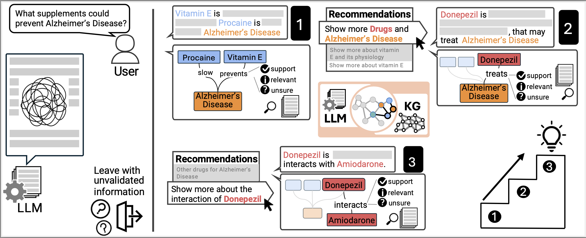

# KNOWNET

<!-- ## [LINK TO DEMO](https://www.umn-visual-intelligence-lab.com/) -->

KNOWNET is a visualization system that enhances health information retrieval by integrating Large Language Models (LLMs) with Knowledge Graphs (KGs). In the era of information overload, finding accurate and relevant health information can be challenging, especially when it involves complex topics like Alzheimer's disease and dietary supplements. Traditional LLMs, while powerful, often generate responses that lack factual accuracy, structured exploration, and clear representation of intricate information structures.

To address these challenges, KNOWNET leverages the structured representation of knowledge graphs to provide enhanced accuracy and structured exploration. It extracts triples (e.g., entities and their relations) from LLM outputs and maps them into the validated information and supported evidence in external KGs. For structured exploration, KNOWNET provides next-step recommendations based on the neighborhood of the currently explored entities in KGs, aiming to guide a comprehensive understanding without overlooking critical aspects.

In contrast to traditional LLM question-answering, which often generates lengthy and unverified text, KNOWNET provides:

- Validation through literature for accuracy, ensuring that the information is supported by scientific research.
- Next-step recommendations for comprehensive exploration, guiding users to a deeper understanding of the topic.
- Step-by-step graph visualization for a progressive understanding of the topic, allowing users to track their exploration journey.

<figure>
    
    <figcaption> <b>In contrast to traditional LLM question-answering (left), which often generate lengthy and unverified text, KNOWNET (right)
leverages external knowledge graph (KG) to enhance health information seeking with LLM. </b> KNOWNET provides (1) validation through
literature for accuracy, (2) next-step recommendations for comprehensive exploration, and (3) step-by-step graph visualization  for a progressive understanding of the topic. </figcaption>
</figure>

---

## Extended Prototype — KNOWNET v2: Web Search Verification & Edge Uncertainty

Following the IEEE VIS 2024 version, we have developed an extended prototype of KNOWNET that replaces Neo4j-based knowledge-graph validation with real-time web-search verification introducing edge-level uncertainty quantification.

This version explores a more general and scalable approach to grounding LLM-generated relations by dynamically validating them against current web sources.  
It maintains KNOWNET’s original goals of transparency and interpretability while expanding its reach beyond curated biomedical graphs.

🔗 **Repository:** [KNOWNET v2 (Web Search + Edge Uncertainty)](https://github.com/maurilaparva/prototype)  
🎥 **Demo:** [View the Web Search Demo](https://maurilaparva.github.io/prototype/)

<figure>
  
  <figcaption>
    <b>KNOWNET v2 introduces dynamic web-search-based verification and edge-level uncertainty quantification.</b>  
    The system assesses the reliability of model-generated relations in real time, broadening the applicability of KNOWNET’s framework.
  </figcaption>
</figure>