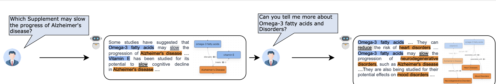
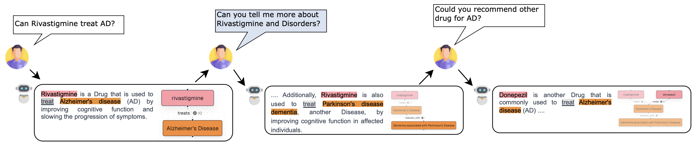

# Use Cases

> This page illustrates the application scenarios of KNOWNET.

<table>
  <tr>
    <td>
        <a href='./#/use-cases?id=alzheimers-disease-supplements'>
            

             
            Alzheimer's Disease Supplements
        </a>
    </td>
    <td>
        <a href='./#/use-cases?id=drugs-and-alzheimers-disease'>
            

             
            Drugs and Alzheimer's Disease
        </a>
    </td>
  </tr>
</table>

### Alzheimer's Disease Supplements

#### Scenario

In this scenario, a user asks KNOWNET about supplements that may slow the progression of Alzheimer's disease. KNOWNET suggests Omega-3 fatty acids and Vitamin E, providing evidence from the knowledge graph. The user then inquires about Omega-3 fatty acids and their impact on various disorders, to which KNOWNET responds with detailed information supported by scientific literature.

#### Demonstration Video

<iframe src="https://player.vimeo.com/video/933121138?badge=0&amp;autopause=0&amp;player_id=0&amp;app_id=58479" frameborder="0" allow="autoplay; fullscreen; picture-in-picture; clipboard-write" style="position:absolute;top:0;left:0;width:100%;height:100%;" title="usecase1_supplement_ad"></iframe>

  

### Drugs and Alzheimer's Disease

#### Scenario

In this use case, a user explores the effectiveness of the drug Rivastigmine in treating Alzheimer's disease. KNOWNET confirms its efficacy and provides relevant evidence. The user further inquires about Rivastigmine's impact on other disorders and its interactions, leading to a comprehensive exploration guided by KNOWNET's structured recommendations and progressive graph visualization.

#### Demonstration Video

  

<iframe src="https://player.vimeo.com/video/933121116?badge=0&amp;autopause=0&amp;player_id=0&amp;app_id=58479" frameborder="0" allow="autoplay; fullscreen; picture-in-picture; clipboard-write" style="position:absolute;top:0;left:0;width:100%;height:100%;" title="usecase2_drug_ad"></iframe>

  

