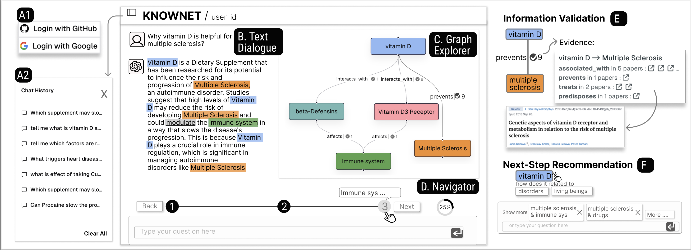

# Interact with KNOWNET

> This page introduces the user interactions supported by KNOWNET.

### Text Dialogue

In the _Text Dialogue_, users can interact with KNOWNET by typing their queries related to health information. The system will provide text responses along with related entities and their relationships highlighted for easy reference.

### Graph Explorer

The _Graph Explorer_ visualizes the relationships between entities as a graph. Users can **click on nodes** to highlight corresponding entities in the Text Dialogue, **drag and drop nodes** to reorganize the layout, and **hover over edges** to view the evidence supporting the relationships.

### Navigator

The _Navigator_ helps users track their exploration history and progress. It displays a series of dots, each representing a query, and a progress bar indicating the proportion of the knowledge graph explored. Users can **click on dots** to revisit previous queries and **use the progress bar** to gauge their exploration progress.

### Recommendations

KNOWNET provides **next-step recommendations** to guide users in their exploration. Recommendations are displayed in the Navigator and the Graph Explorer, and users can **click on recommendation buttons** to automatically submit the suggested queries.

### Information Validation

Users can validate the information provided by KNOWNET by **clicking on edge labels** in the Graph Explorer. This action opens a pop-up window displaying the scientific literature supporting the relationship, allowing users to verify the accuracy of the information.

## Demonstration Video

For a comprehensive understanding of how to interact with KNOWNET, please watch the demonstration video below:

  
 :eyes: <b>Click to View the Demo</b> 

  

<iframe src="https://player.vimeo.com/video/933121471?badge=0&amp;autopause=0&amp;player_id=0&amp;app_id=58479" frameborder="0" allow="autoplay; fullscreen; picture-in-picture; clipboard-write" style="position:absolute;top:0;left:0;width:100%;height:100%;" title="interface_overview"></iframe>
<script>

  

